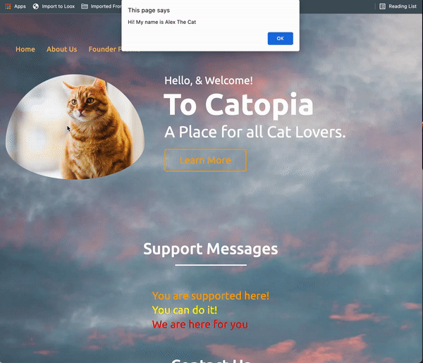

# Frontend-Foundation
A simple frontend website to practice HTML, CSS, and basic JS-Interactivity

## Summary
This is a website meant for cat lovers and as apractice of event listeners, and CSS, HTML. Users can browse around three pages, fill in forms, get random restaurant recommmendations etc. 

## Gif of Website
